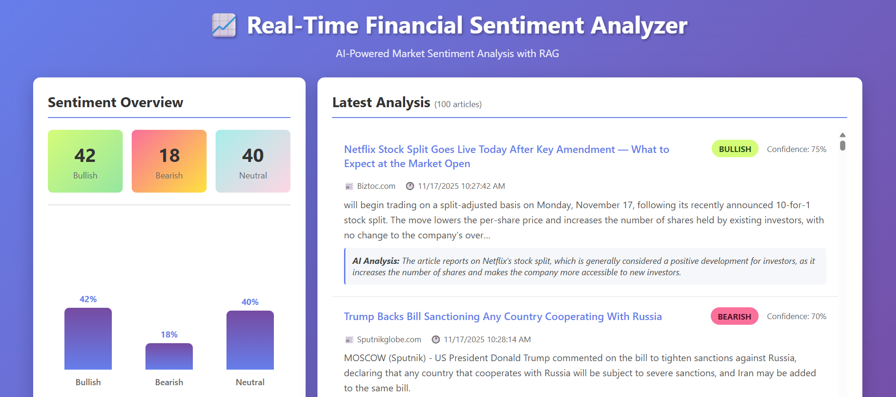

# Real-Time Financial News Sentiment Analyzer

A complete end-to-end data pipeline that ingests real-time financial news, analyzes sentiment using AI with Retrieval-Augmented Generation (RAG), and displays results on a live web dashboard.



## 🎯 Features

- **Real-time Data Streaming** with Apache Kafka
- **AI-Powered Sentiment Analysis** using Ollama with Llama 3
- **Contextual Retrieval** with FAISS vector database (RAG)
- **Live Visualization** with FastAPI and interactive dashboard
- **Containerized Deployment** with Docker Compose

## 🏗️ Architecture
```
NewsAPI → Producer → Kafka → Consumer (+ RAG + LLM) → Kafka → Dashboard → User
                                  ↓
                            FAISS Vector DB
```

## 🚀 Quick Start

### Prerequisites

- Docker and Docker Compose
- NewsAPI key (free at https://newsapi.org/)
- At least 8GB RAM
- 20GB free disk space

### Installation

1. **Clone the repository:**
```bash
git clone https://github.com/YOUR_USERNAME/realtime-sentiment-analyzer.git
cd realtime-sentiment-analyzer
```

2. **Configure environment variables:**
```bash
# Copy the example file
cp .env.example .env

# Edit .env and add your NewsAPI key
# NEWS_API_KEY=your_actual_api_key_here
```

3. **Start all services:**
```bash
docker-compose up -d
docker start sentiment_consumer
```

4. **Reset consumer to process all articles:**
```bash
docker stop sentiment_consumer
docker exec -it kafka kafka-consumer-groups --bootstrap-server localhost:9092 --delete --group sentiment_consumer_group
docker start sentiment_consumer
```

5. **Access the dashboard:**
```
http://localhost:8000
```

## 📊 What You'll See

- **Sentiment Overview**: Count and percentage of Bullish/Bearish/Neutral articles
- **Visual Chart**: Bar chart showing sentiment distribution
- **Latest Analysis**: Real-time feed of analyzed articles with:
  - Article titles with links
  - Sentiment badges (green/red/blue)
  - Confidence scores (0-100%)
  - AI-generated justifications

## 🔧 Configuration

### Environment Variables

| Variable | Description | Default |
|----------|-------------|---------|
| `NEWS_API_KEY` | Your NewsAPI key | Required |
| `FETCH_INTERVAL` | Seconds between news fetches | 300 |
| `KAFKA_BOOTSTRAP_SERVERS` | Kafka connection | kafka:9092 |
| `OLLAMA_URL` | Ollama API endpoint | http://ollama:11434 |
| `OLLAMA_MODEL` | LLM model to use | llama3 |

## 🛑 Stopping the Project
```bash
docker-compose down
```

## 🔄 Daily Usage

### Start:
```bash
docker-compose up -d
docker start sentiment_consumer
```

### Stop:
```bash
docker-compose down
```

## 🐛 Troubleshooting

### No articles appearing?
Reset consumer offset:
```bash
docker stop sentiment_consumer
docker exec -it kafka kafka-consumer-groups --bootstrap-server localhost:9092 --delete --group sentiment_consumer_group
docker start sentiment_consumer
```

### Check logs:
```bash
docker logs -f sentiment_consumer
docker logs -f financial_producer
```

## 📦 Technology Stack

- **Streaming**: Apache Kafka + ZooKeeper
- **Producer**: Python + requests
- **Consumer**: Python + sentence-transformers + FAISS
- **LLM**: Ollama + Llama 3
- **Backend**: FastAPI
- **Frontend**: HTML/CSS/JavaScript
- **Deployment**: Docker Compose

## 🎓 How RAG Works

1. **Embedding Generation**: Convert articles to 384-dimensional vectors
2. **Vector Storage**: Store embeddings in FAISS
3. **Context Retrieval**: Find 3 most similar articles for each new article
4. **Enhanced Prompting**: Send article + similar articles to LLM
5. **Better Analysis**: Context helps LLM provide more accurate sentiment

## 📝 License

MIT License - feel free to use for learning and projects!

## 🤝 Contributing

Pull requests welcome! Please ensure:
- No API keys in commits
- Code follows existing style
- Update documentation as needed

## ⚠️ Important Notes

- Free NewsAPI: 100 requests/day limit
- First run downloads Llama 3 model (~4.7GB)
- Consumer processes ~10-30 seconds per article
- Dashboard auto-refreshes every 3 seconds

## 🙏 Acknowledgments

- NewsAPI for financial news data
- Ollama for local LLM inference
- Confluent for Kafka Docker images


## 📁 **Final Project Structure to Upload**
```
realtime_sentiment_analyzer/
├── .gitignore                 # Git ignore file
├── .env.example              # Environment template
├── README.md                 # Documentation
├── docker-compose.yml        # Docker orchestration
├── dashboard-screenshot.png  # Dashboard preview
├── producer/
│   ├── Dockerfile
│   ├── producer.py
│   └── requirements.txt
├── consumer/
│   ├── Dockerfile
│   ├── consumer.py
│   ├── start.sh
│   └── requirements.txt
└── dashboard/
    ├── Dockerfile
    ├── app.py
    └── requirements.txt
```

**NOT UPLOADED** (protected by .gitignore):
- `.env` - Contains your API key
- `ollama_models/` - Large model files (~4.7GB)
